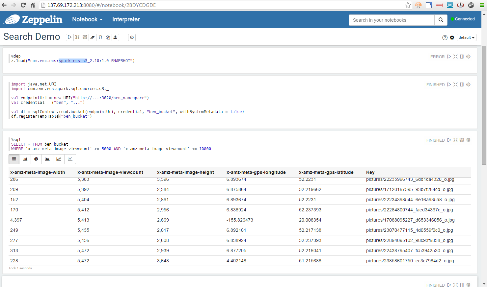

# Bucket Metadata Search with Spark SQL

The [spark-ecs-s3](https://github.com/emcvipr/spark-ecs-s3) project makes it possible to view an ECS bucket as a Spark dataframe. 
Each row in the dataframe corresponds to an object in the bucket, and each column coresponds to a piece of object metadata.

**How it Works**

Spark SQL supports querying external data sources and rendering the results as a dataframe.   With the [PrunedFilteredScan](https://spark.apache.org/docs/latest/api/scala/index.html#org.apache.spark.sql.sources.PrunedFilteredScan) trait, the external data source handles column pruning and predicate pushdown.  In other words, the WHERE clause is pushed to ECS by taking advantage of the bucket metadata search feature of ECS 2.2.



# Using
## Quickstart
Run the below then open your browser to `<host>:8080`.
```
docker run -itd --name zeppelin -p 8080:8080 emccorp/spark-ecs-s3:latest
```

## Building
1. Install sbt ([instructions](http://www.scala-sbt.org/0.13/docs/Setup.html)).
2. Build and install the spark-ecs-s3 library to the Maven local repository with `sbt publishM2`.

## Zeppelin
1. Install Zeppelin.
2. `export SPARK_LOCAL_IP=127.0.0.1`
3. `bin/zeppelin.sh`

Create a notebook with the following commands.   Replace `***` with your S3 credentials.

```
%dep
z.load("com.emc.ecs:spark-ecs-s3_2.10:1.0-SNAPSHOT")
```

```
import java.net.URI
import com.emc.ecs.spark.sql.sources.s3._

val endpointUri = new URI("http://10.1.83.51:9020/")
val credential = ("***ACCESS KEY ID***", "***SECRET ACCESS KEY***")

val df = sqlContext.read.bucket(endpointUri, credential, "ben_bucket", withSystemMetadata = false)
df.registerTempTable("ben_bucket")
```

```
%sql
SELECT * FROM ben_bucket 
WHERE `image-viewcount` >= 5000 AND `image-viewcount` <= 10000
```

## TODO
1. Implement 'OR' pushdown.  ECS supports 'or', but not in combination with 'and'.
2. Avoid sending a query containing a non-indexable key.
