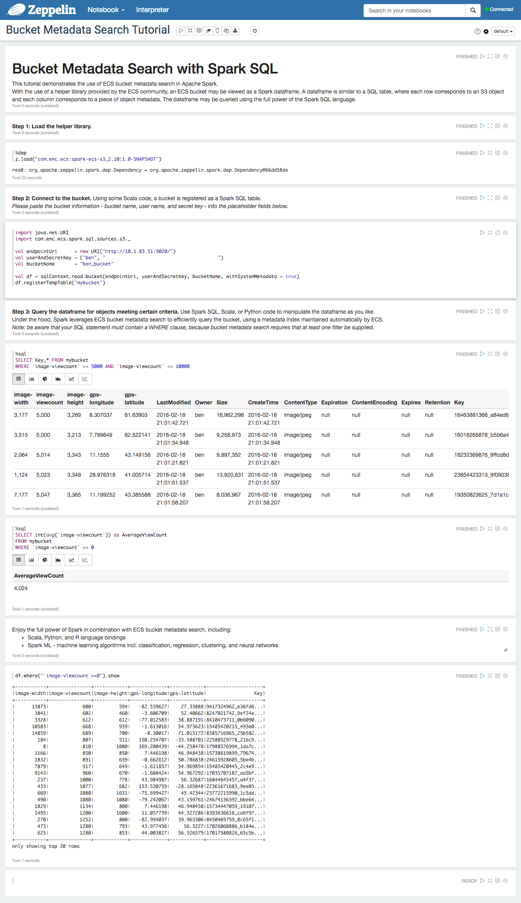

# Bucket Metadata Search with Spark SQL

The [spark-ecs-s3](https://github.com/emcvipr/spark-ecs-s3) project makes it possible to view an ECS bucket as a Spark dataframe. 
Each row in the dataframe corresponds to an object in the bucket, and each column coresponds to a piece of object metadata.

Spark SQL supports querying external data sources and rendering the results as a dataframe.   With the [PrunedFilteredScan](https://spark.apache.org/docs/latest/api/scala/index.html#org.apache.spark.sql.sources.PrunedFilteredScan) trait, the external data source handles column pruning and predicate pushdown.  In other words, the WHERE clause is pushed to ECS by taking advantage of the bucket metadata search feature of ECS 2.2.



# Using
## Prerequisites
1. Install sbt.
2. Build the `feature-bucket-metadata` branch of the `ecs-object-client` repository
3. Install the `ecs-object-client` to the Maven local repository with `gradle install -x javadoc`.

## Building
1. Install the library to the Maven local repository with `sbt publishM2`.

## Zeppelin
1. Extract Zeppelin binary distribution.
2. `export SPARK_LOCAL_IP=127.0.0.1`
3. `bin/zeppelin.sh`

Create a notebook with the following commands.   Replace `...` with the S3 secret key.

```
%dep
z.load("com.emc.ecs:spark-ecs-s3_2.10:1.0-SNAPSHOT")
```

```
import java.net.URI
import com.emc.ecs.spark.sql.sources.s3._

val endpointUri = new URI("http://10.1.83.51:9020/ben_namespace")
val credential = ("ben", "...")

val df = sqlContext.read.bucket(endpointUri, credential, "ben_bucket", withSystemMetadata = false)
df.registerTempTable("ben_bucket")
```

```
%sql
SELECT * FROM ben_bucket 
WHERE `x-amz-meta-image-viewcount` >= 5000 AND `x-amz-meta-image-viewcount` <= 10000
```

## TODO
1. Implement column pruning.  I believe the `queryObjects` call accepts a list of attributes to return, rather than returning all.
2. Implement 'OR' pushdown.  ECS supports 'or', but not in combination with 'and'.
3. Support system metadata.    Partial support is there to query and display system metadata, but the reader logic in `BucketMetadataRDD.cols` is incomplete.

